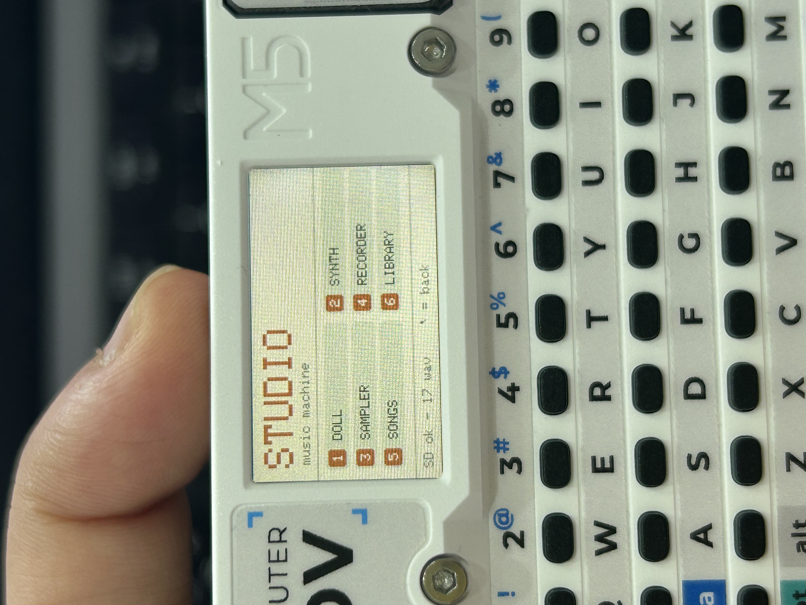

# STUDIO — Cardputer Music Machine



A self-contained groovebox firmware for the **M5 Cardputer (ESP32-S3, ES8311 codec)** —
synth + sequencer + sampler + microphone recorder + song library, all in one firmware.
No M5Unified dependency: uses LovyanGFX for the screen, a small I2C driver for the
keyboard, and the legacy ESP-IDF i2s driver for ES8311 record/playback (so the mic
actually records).

## Quick Start — just flash it

**Don't want to install a build environment? Grab the prebuilt firmware.**

1. Go to the [**Releases**](https://github.com/YONGHU-YUAN/cardputer-studio/releases/latest) page and download `cardputer-studio-v1.0.0-merged.bin`.
2. Flash it to your Cardputer at offset `0x0` with **M5Burner** (GUI) or **esptool**:
   ```
   esptool.py --chip esp32s3 --port <PORT> --baud 921600 write_flash 0x0 cardputer-studio-v1.0.0-merged.bin
   ```
3. Pop in a FAT32 microSD card (put 16-bit PCM `.wav` files in `/samples` for the sampler), reset, and you're in.

Full flashing instructions (M5Burner steps, separate binaries, troubleshooting) are in the [latest release notes](https://github.com/YONGHU-YUAN/cardputer-studio/releases/latest).

## Quick reference card

A one-page printable key map: [English](STUDIO-guide-EN.pdf) · [中文](STUDIO-guide-CN.pdf)

## Features

- **SYNTH / sequencer** — 2 melodic tracks (A/B) + 8-voice drum track (3 kits: ACOU/808/909)
  + a **phrase track** that plays a trimmed slice of a long recording.
  - Wavetable voices (saw / square / triangle / sine), ADSR, tone (brightness) control
  - Per-track effects: delay, octave, sub, fifth, chorus
  - Per-step probability, chords, swing, 32-step pattern with paging
  - Live FX: bitcrush, tape-stop, arpeggiator, sample reverse, reverse playback
  - Phrase track per-step controls: stack effects (OCT/SUB/CHO/DLY/REV/STUT),
    movable window, length, pitch
  - 16 song save slots (saved to SD)
- **SAMPLER** — play any 16-bit WAV on the SD card pitched across the keyboard
- **RECORDER** — record the mic straight to SD (streamed, low RAM), play back
- **SONGS** — browse / preview / rename / open saved songs
- **LIBRARY** — browse / play / delete / rename recordings

## Hardware (Cardputer Adv / ESP32-S3)

- Display: ST7789 on SPI2 (sclk 36, mosi 35, dc 34, cs 37, rst 33)
- Keyboard: TCA8418 on internal I2C (SDA 8, SCL 9, addr 0x34)
- Codec: ES8311 on internal I2C (addr 0x18); I2S BCLK 41, LRCK 43, DIN 46, DOUT 42
- SD card: separate SPI (sck 40, miso 39, mosi 14, cs 12)

## Build

Arduino + arduino-cli with the ESP32 core:

```
arduino-cli compile --fqbn esp32:esp32:m5stack_cardputer studio
arduino-cli upload  -p <PORT> --fqbn esp32:esp32:m5stack_cardputer studio
```

Put 16-bit PCM WAV files in `/samples` on the SD card to use as sampler / phrase sources.

## Controls

Press `ctrl` inside SYNTH for the on-device key map. Menu: `1` SYNTH · `2` SAMPLER ·
`3` RECORDER · `4` SONGS · `5` LIBRARY · `` ` `` back.

---
Made on a Cardputer, for fun. 🎛️

Made by Yuan · [GitHub](https://github.com/YONGHU-YUAN)

Licensed under the [MIT License](LICENSE).
